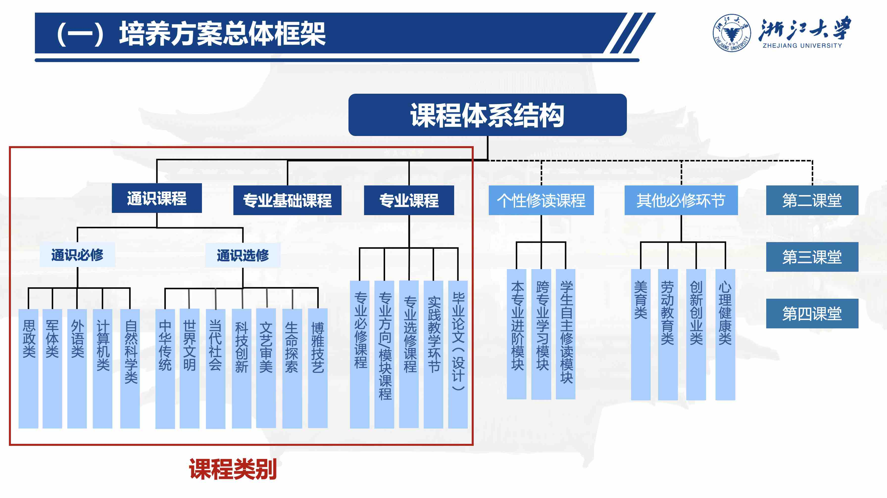

---
author:
    - yy
    - cj
---

# **学业基本制度**

!!! quote "竺老两问"
    

    **诸位在校，有两个问题应该自己问问，第一，到浙大来做什么？第二，将来毕业后要做什么样的人？**
    

这两个问题你一定在录取通知书上看到过。这个问题要用几年甚至一生去回答，每个人的答卷也一定不同。但是，毕业应当是第一个问题的最低要求。接下来会介绍一些学业方面的基本制度。

## 学期

浙大的一学年分为**秋冬学期**、**春夏学期**和暑学期（俗称**短学期**）。秋冬学期分为秋学期（八周）、冬学期（八周）和期末考试周（两周）；春夏学期同理。暑学期课程请查询培养方案，持续时长由对应课程而定。期中考试安排在秋（春）八周和冬（夏）一周周末，期末考试安排在期末考试周。只有部分课程需要期中考。

此外部分课程仅持续半个长学期（八周），秋（春）学期对应课程期末考安排在期中考试时间，冬（夏）学期对应课程期末考安排在期末考试周。

## 学分和绩点

> **简单来说，学分是“量”，绩点是“质”**

大学的学习生活中每一门课程都有对应的学分，学分的多少和该课程的每周学时有关。比如：
> 微积分（甲）Ⅰ：5学分 | 5（+1）周学时
> 
> Python程序设计：3学分 | 4周学时。

每一门课程根据你的上课表现、作业情况和考试情况会给定一个总体评价分数（总评），根据总评会获得一个对应的绩点。最常用的绩点制是**五分制**，其与百分制成绩对应关系如下：

**图1.** 课程成绩和绩点对应表

**均绩**（GPA, Grade Point Average）是所有课程绩点的加权平均，是对学生学业成绩的综合评价（但不是全部！）。其计算方法是：

$$\text{均绩} = \sum \frac{\text{课程学分}\times\text{课程绩点}}{\text{总学分}}$$

*（公式加载不出来刷新网页即可）*

每一个长学期和学年都会计算一次学期/学年平均绩点。学年均绩和该学年的个人荣誉（学习类）申请、奖学金申请以及保研申请有关。

## 培养方案

在大学，每一个人的课表都是独一无二的。同一个大类内的同学，由于专业不同，培养方案不同，修读的课程也就不同；哪怕是同一个专业的同学，虽然培养方案一样，但是由于有不同的授课教师以及不同的授课时间，因此课表也会完全不一样；此外还有个性选修的通识选修课程，也会影响课表的布局。

由于选课依据的是培养方案，因此首先要学会看培养方案，随后{==按照培养方案进行选课。==}

培养方案查询的**唯一官方网站**是[教务网](http://zdbk.zju.edu.cn){target=_blank}。

**图2.** 培养方案总体框架

## 一二三四课堂

第一课堂指传统意义上的校内课程学习，此外浙江大学还有第二课堂、第三课堂和第四课堂，也有学分要求。

> 关于二三四课堂的规范性文件，请参阅[浙江大学本科生第二、三、四课堂学分管理办法（最新为 2024-01-15 版）](http://10.203.3.207:8080/xwfw/gfxwj/tpl/template-1/info.html?id=3237&list=gfxwj&context=&style=){target=_blank}

- 第二课堂是指学生**在校内参加的各类实践项目**，包括参与理想信念教育、文化艺术活动、学科竞赛、创新创业和科研实践训练、科学研究、学术报告、学生工作等；
- 第三课堂是指学生**在校外、境内参加的各类社会实践、就业创业实践实训等项目**，以及校内外**志愿服务**活动；
- 第四课堂是指学生参加国（境）外高校等开展的各类**国际化学习交流活动**。

!!! info "注"
    有关第二三四课堂的表述中，“记点”等同于“学分”。

### 第一课堂

第一课堂的课程修读要求，会全部写在**培养方案**中。课程大致分以下几个类别：

#### 1. 通识课程

##### 1.1 思政类

各专业基本一致，必修。

“四史”课程选一门即可，包括：

- 中国改革开放史
- 新中国史
- 中国共产党历史
- 社会主义发展史

##### 1.2 军体类（10.5学分）

- “军”：军训（2学分）和军事理论（2学分），必修。

- “体”：前三年应修够 6 学分的体育课（体育课种类非常多，详见[体育课]），也就是每个长学期需选择一门体育专项课程。
  - 大四有个“体测与锻炼 I”（0.5学分），就是完成一年一度的[体测]和[体育打卡]。
  - 此外，大一两个学期需要额外修读身体素质课（0学分，但是必修！）

##### 1.3 外语类（6+1 学分）

外语类课程选修学分须修满 6 学分，还有 1 学分是“英语水平测试”，俗称“水测”。

!!! info "免水测"
    有三个途径可以免水测，达到其一即可：

    - “托福”考试成绩 95 分以上 (含 95 分)
    - “雅思”成绩 7 分以上 (含 7 分)
    - 全国大学英语六级考试笔试 550 分 (各分项均及格) 且口试分数为 B 级以上 (含 B 级)

> 官方文件：[浙江大学本科生“外语类”课程修读管理办法](http://www.sis.zju.edu.cn/_upload/article/files/d8/53/6fe89b7c4d0a95190a881b958bd9/91d9af87-67e6-4db7-9a0e-8465a552d99d.pdf){target=_blank}

##### 1.4 计算机类（2+3 学分）

- 2学分：理工农医类（不含计算机类专业）学生需修读“人工智能基础（A）”课程。
- 3学分：编程语言类课程，具体要求见专业培养方案。

##### 1.5 自然科学通识类

即数理基础课，具体要求见专业培养方案。

##### 1.6 通识选修课程（10.5学分）

除满足学分要求外，通识选修课程有很多类别，类别也有要求：

- 至少修读1门通识核心课程
- 至少修读1门“博雅技艺”类课程
- 理工农医学生在“中华传统”“世界文明”“当代社会”“文艺审美”四类中至少修读2门

某些课程可能两种类别都符合，可以同时计入。

> 例：《杭州与中华文化》同时属于“中华传统”和“通识核心课程”。

#### 2. 专业基础课程

见培养方案，大一课程一般以[通识课程]为主。

#### 3. 专业课程

见培养方案，大一课程一般以[通识课程]为主。

#### 4. 个性修读课程

{++2024级培养方案将个性修读课程的学分增加到了 15 学分++}，其中包括：

```mermaid
graph LR
    A(个性课程<br>（三选一，15学分）)
    A --o B[本专业进阶模块]
    A --o C[跨专业学习模块]
    A --o D[自主修读模块]
    B --- E[专业高阶课程]
    C --- F[学生可修读其他院系开设的微辅修项目]
    D --- G[学生可自主选择课程]
```

三种模块选择一种即可。其他部分要求此处略去，**以培养方案为准**。

#### 5. 其他必修环节

```mermaid
graph LR
    A(认定型)
    A --o B[美育]
    A --o C[劳育]
    A --o D[创新创业]
    A --o E[心理健康]
```

其中，

- 美育课**很难选**，最好早点开始选（比如笔者现在还没选上）

- 心理健康类课程为 24 级新增要求。

认定型课程，和前文的通识选修课程类似，修读的课程有某个类别的标签就可以认定该类别。

### 第二课堂

> 学分要求: 4分（其中美育二课分至少1分）

主要来源：

- 参加（有二课认定的）各类文体活动（比赛类根据名次给分、表演类出演0.5分/次）
- 观看文艺演出（0.15分/次）
- SQTP 项目（根据收验成绩给分）等。

其中需要至少1分的美育二课分，主要来源是**参加美育类演出/讲座**（作为出演人员 0.5 分/次、作为观众 0.15 分/次）

尤其需要注意美育二课，{==美育满 1 分是硬性要求==}，大部分同学美育二课的主要来源是观看文艺演出，因此需要 7 次有效观看（指完成报名、签到和签退）才可以达标，所以需要尽早开始积累。当然也可以参演文艺类表演，有文艺类特长的同学可以选择加入一些艺术团，就不需要担心美育二课的问题了。

### 第三课堂

> 学分要求: 2分

主要来源是：

- 社会实践
- 参加志愿者活动

其中社会实践{==需要至少一次==}（通过考核 1 分/次，校级优秀 1.5 分/次）（注意一个长假期只能认定一次）。

志愿者根据小时数评定星级，依据志愿者星级给 1.5 - 3.5 的三课分。

| 志愿者星级 | 一星级 | 二星级 | 三星级	| 四星级 | 五星级 |
| --- | --- | --- | --- | --- | --- |
| 所需小时数 | 40h | 70h | 150h | 200h | 250h |
| 对应三课记点 | 1.5 | 2.0 | 2.5 | 3.0 | 3.5 |

### 第四课堂

国际交流学分2分，注意这个和**国际化课程学分**是不同的！

所有获得四课分的方式如下：（摘自官方文件）

1. 赴国（境）外高校等参加并完成与我校共建的 2+2、3+X等联合培养项目；
2. 赴国（境）外高校等参加交流项目并获得有效课程学分；
3. 赴国（境）外高校等参加 4 周及以上的各类交流项目并提供修读证明等相关材料；
4. 赴国（境）外高校等参加少于 4 周的交流项目且没有获得有效课程学分的，需再修读 1 门经学校认定的国际化课程且考核通过；
5. 参加线上境外交流项目并达到《浙江大学本科生线上境外交流与合作项目管理办法（试行）》（浙大本发〔2022〕4 号）中关于“国际化模块”的要求；
6. 参加线上境外交流项目，但未达到《浙江大学本科生线上境外交流与合作项目管理办法（试行）》（浙大本发〔2022〕4 号）中关于“国际化模块”要求的，需再修读 1 门经学校认定的国际化课程且考核通过；
7. 已获得第三课堂 2 学分并认定等级者，使用其多余记点中的 2 记点替换“第四课堂”学分的，需再修读 1 门经学校认定的国际化课程且考核通过。

其中特别需要注意四课认定的第 7 条，即所谓“三转四”，也就是如果可以获得 4 分的三课分，可以选择把多余的 2 分转为四课分，再修读一门校内认定的“国际化课程”即可完成四课要求，就不需要再进行国际交流。

[体育课]: ../Study/PE.md
[体测]: ../Study/PE.md
[体育打卡]: ../Study/PE.md
[通识课程]: ../Study/Concepts.md#1